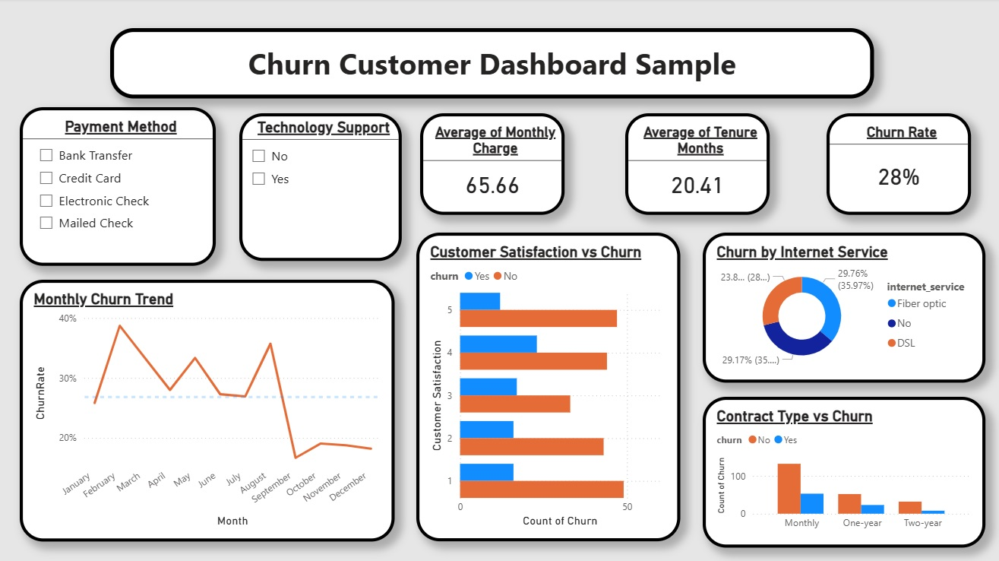

# churn-customer-dashboard
This project is a full analytical dashboard designed to understand 
-	customer churn patterns
-	identify retention risks
-	analyze key behavioral 
-	financial drivers behind customer churn

Tools Used:
-	Power BI
-	Power Query
-	DAX
-	Churn Dataset (CSV).

How to Use
1) Download Power BI File
2) open file in Power B] Desktop
3) Connect to CSV file

It demonstrates essential data analytics skills required for Data Analyst roles

## Dashboard Preview  

